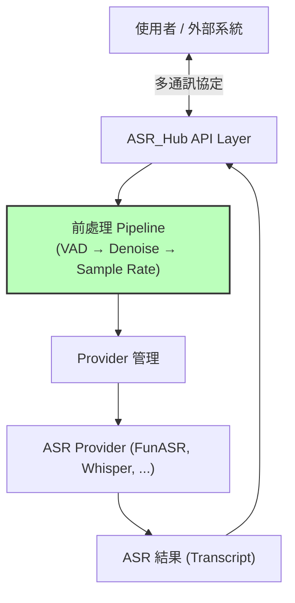
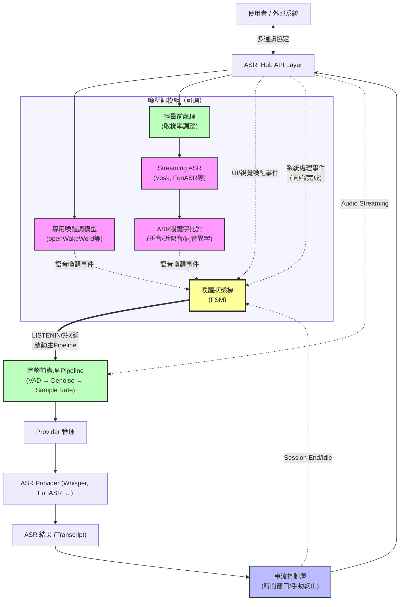

# Software Requirements Specification (SRS)

## 專案名稱：ASR\_Hub

---

## 1. 專案簡介

**ASR\_Hub** 是一套語音辨識中介（ASR Proxy）系統，旨在整合多種語音轉文字（ASR）服務提供商，包括但不限於 FunASR、Local Whisper、Vosk、Google STT API、OpenAI API 等。系統提供統一介面接收語音資料，支援模組化 Pipeline 前處理與彈性 Provider 管理，讓應用程式能高效且動態調用多元 ASR 能力。

---

## 2. 功能需求

### 2.1 支援的通訊協定

* HTTP SSE (Server-Sent Events)
* WebSocket
* Socket.io
* gRPC
* Redis

各協定需支援以下控制指令：
* `start`：開始語音辨識
* `stop`：終止語音辨識  
* `status`：查詢當前狀態
* `busy_start`：通知系統開始處理（進入 BUSY 狀態）
* `busy_end`：通知系統處理完成（離開 BUSY 狀態）

---

### 2.2 語音資料處理方法

* `transcribe`：接收完整語音檔案進行轉譯（對應架構圖 4.1）
* `transcribe_stream`：接收語音串流（聲音 Buffer）進行即時轉譯（對應架構圖 4.2）

#### 2.2.1 串流控制機制

`transcribe_stream` 支援以下控制功能：

##### 終止方式
* **時間窗口終止**：當一段時間內沒有偵測到語音活動時自動終止
* **手動終止**：由用戶或應用程式主動發送終止指令

##### BUSY 狀態管理
* **進入 BUSY**：當系統開始處理（如 TTS 播放、LLM 生成）時，ASR 自動進入 BUSY 狀態
* **BUSY 期間**：不累計 timeout，音訊持續接收但不觸發新的處理
* **離開 BUSY**：處理完成後自動回到 LISTENING 狀態

##### Session 管理
* **Session ID**：每個串流連線分配唯一 ID，便於管理多個並行 session
* **Session 狀態**：與 FSM 狀態對應（IDLE、LISTENING、BUSY）

#### 2.2.2 雙層監聽架構

當啟用喚醒詞模組時，系統採用雙層監聽架構：

* **表層（用戶層）**：`transcribe_stream` 終止後停止向用戶傳送辨識結果
* **底層（系統層）**：即使 `transcribe_stream` 終止，系統仍在背景持續監聽以偵測喚醒詞

這種設計確保系統能隨時響應喚醒詞，而不影響用戶體驗。

---

### 2.3 前處理模組（Pipeline Operators）

系統採用 RxJS 風格的流式架構，所有前處理皆以 operator 形式組合，常見 operator 如下：

* `vad`：語音活動偵測（如 webrtc\_vad, silero\_vad 等）
* `denoise`：降噪（如 rnnoise, noisereduce 等）
* `sample_rate_adjustment`：取樣率調整
* `voice_separation`：人聲分離
* `recording`：錄音功能（可設定錄音參數、儲存路徑等）
* `format_conversion`：格式轉換（主要用於 `transcribe` 方法，當 ASR Provider 不支援原始音檔格式時自動轉換）
* `wakeword`：喚醒詞偵測（支援多種實現，詳見 2.4）

#### 2.3.1 Operator 管理與驗證機制

為了讓使用者能彈性組合各種 Operator 並同時避免組合錯誤、效能瓶頸或執行風險，ASR\_Hub 系統**導入以下四道保險機制**：

##### 1. 組合檢查（Static Validation）

* 在 pipeline 配置階段，自動檢查是否存在不合適的 Operator 組合（如連續多個 VAD、不支援的格式鏈接、降噪在不支援格式後等），並即時報錯或發出警告。
* 建議採用 YAML schema、靜態檢查腳本等方式實現。

##### 2. 資源預警（Resource Warning）

* 每個 Operator 標註「資源預估等級」與適用情境，pipeline 組合時累積評估，若超出系統建議閾值則發出預警，並提示用戶最佳化建議。
* 系統提供預設資源組合表，提醒用戶組合過重時的風險。

##### 3. 最佳實踐說明（Best Practice Documentation）

* 官方文件提供多種常見情境下的推薦 pipeline 組合範例（如遠端會議、嘈雜環境、錄音等），說明各 Operator 選用依據。
* UI/CLI 可根據場景自動推薦適合的 operator 組合。

##### 4. 失敗自動處理（Auto Fallback/Recovery）

* 若某 Operator 運作異常（如格式不符、模型異常、記憶體溢位等），可自動 disable 或 fallback 至預設方案，並將異常資訊納入日誌與回報。

##### Operator 實現注意事項

* 每個 Operator 支援必要參數配置（如敏感度、buffer 大小、格式、硬體資源等），
* **Pipeline 採用 Filter/Early Return 設計**：如 VAD 判定靜音時，後續 operator 可直接 idle/return，減少無效資源消耗。

#### 完整 Operator 範例（包含所有可選項）

```yaml
pipeline:
    operators:
        - name: webrtc_vad
            enabled: true
            params:
                sensitivity: 0.5
        - name: rnnoise_denoise
            enabled: true
        - name: voice_separation
            enabled: false
        - name: recording
            enabled: false
            params:
                save_path: "recordings/"
                format: "wav"
                channels: 1
                sample_rate: 16000
        - name: sample_rate_adjustment
            enabled: true
            params:
                target_rate: 16000
        - name: format_conversion
            enabled: false
            params:
                format: wav
        - name: wakeword
            enabled: true
            params:
                type: openWakeWord # or asr_keyword
                ...
```

#### 2.3.2 Operator 使用場景說明

* **VAD**：減少無聲段處理，提升效率，特別適用於 `transcribe_stream`。建議 VAD 置於 pipeline 前段。
* **降噪**：改善語音品質，提高辨識準確率。多種降噪工具可依場景切換，但建議單 pipeline 僅啟用一個主要降噪 operator。
* **人聲分離**：適用於多人對話或背景音樂場景。建議搭配有標註語者的場合使用。
* **格式轉換**：主要用於 `transcribe` 方法，當 ASR Provider 不支援原始音檔格式時自動轉換。
* **取樣率調整**：統一音訊規格，符合 ASR Provider 要求。在喚醒詞輕量前處理中也常使用。
* **錄音**：除錯、審計、訓練資料收集等用途，通常放在 pipeline 最末端。
* **喚醒詞偵測**：見下方 2.4。

---

### 2.4 喚醒詞偵測模組（Wake Word Detection）

#### 2.4.1 模組簡述

* 可作為 Pipeline Operator 插入，支援兩種主要型態：

  1. **專用模型型（如 openWakeWord、Snowboy、Porcupine）**

     * 直接連接麥克風原始資料流，獨立於 VAD 和降噪 operator，**不受 pipeline 控制（always-on）**。
     * 設計為極低延遲、低資源常駐運行。
     * 支援可選輕量級前處理（如簡易降噪），但需避免過度處理導致喚醒失效。
  2. **ASR 關鍵字比對型（包含拼音、近似音、同音異字）**

     * 作為一般 pipeline operator，**通常配置在 VAD 之後、ASR 之後**。
     * 只有 VAD 判定有語音時才會經過 ASR、進行文字層比對。
     * 可設定拼音比對、同音異字、近似音等 fuzzy matching 功能。
* 兩種喚醒詞類型可**同時啟用、平行執行**，可根據需求獨立管理狀態、日誌與資源。
* 提供事件型態（語音、UI、視覺等），可維持喚醒狀態。

#### 2.4.2 喚醒詞偵測資料流架構

（參見架構圖 4.2 中的喚醒詞模組）

* **專用模型路徑**（如 openWakeWord）：直接連接原始音訊，always-on，獨立於主要 pipeline。
* **ASR 關鍵字路徑**：經過輕量前處理後，使用 Streaming ASR 進行文字層比對。
* **兩種偵測結果可同時觸發 FSM 狀態機，實現彈性喚醒策略。**

#### 2.4.3 喚醒詞偵測方法

系統支援兩種喚醒詞偵測方法：

##### 方法一：ASR 關鍵字比對

* 使用 ASR 模組進行語音轉文字後比對
* 支援智慧比對功能：

  * **拼音比對**：處理中文同音字（如「小明」vs「曉明」）
  * **同音異字**：自動識別發音相同但字形不同的詞彙
  * **近似音比對**：容錯處理口音或發音不清的情況
* 優點：靈活度高，可動態調整關鍵字，無需重新訓練
* 缺點：運算成本較高，延遲稍大，建議與 VAD 串接減少資源浪費

##### 方法二：專用喚醒詞模型

* 使用專門訓練的輕量級模型（如 openWakeWord、Snowboy、Porcupine）
* 基於 RNN/CNN 等神經網路架構
* 優點：低延遲、低功耗、高準確率
* 缺點：需預先訓練，更換喚醒詞需重新訓練模型

#### 2.4.4 有限狀態機（FSM）簡要說明

**啟用喚醒詞模組時的狀態**：

| 狀態        | 意義                   | 備註                        |
| --------- | -------------------- | ------------------------- |
| IDLE      | 系統待機，等待喚醒或事件         | 初始狀態（僅在啟用喚醒詞時存在）        |
| LISTENING | 喚醒後持續監聽事件（語音/UI/視覺）  | 保持喚醒，重設 wake_timeout      |
| BUSY      | 系統處理中（如 TTS/LLM 回覆中） | 不累加 timeout，結束回 LISTENING |

**未啟用喚醒詞模組時**：
- 系統僅有 LISTENING 和 BUSY 兩種狀態
- 無 IDLE 狀態，無 wake_timeout
- 串流由 silence_timeout 或手動終止控制

**主要事件（啟用喚醒詞時）**：

* 偵測到喚醒詞/按鈕/視覺用戶 → 從 IDLE 進入 LISTENING
* 用戶互動（語音、UI、視覺等） → 重設 wake_timeout
* **系統開始處理事件**（如開始 TTS 播放、LLM 生成等）→ 進入 BUSY
* **系統處理完成事件**（如 TTS 播放結束、LLM 回覆完成）→ 從 BUSY 回到 LISTENING
* 持續無事件達 wake_timeout（且非 BUSY 狀態）→ 回到 IDLE
* 收到終止指令 → 結束 session，回到 IDLE

**主要事件（未啟用喚醒詞時）**：

* 連線建立 → 直接進入 LISTENING
* **系統開始處理事件** → 進入 BUSY
* **系統處理完成事件** → 從 BUSY 回到 LISTENING
* 靜音達 silence_timeout → 終止串流
* 收到終止指令 → 終止串流

> 詳細 FSM 及事件處理另見後續技術文件。

---

### 2.5 Provider 管理

* 動態列舉所有已整合的 ASR Provider（含特性、優缺點）
* 提供 API 端點查詢當前配置狀態（顯示 YAML 設定）
* 用戶可指定使用特定 Provider
* 未指定 Provider 時使用預設 Provider
* **錯誤處理原則**：

  * 支援自動重試機制（網路暫時性錯誤）
  * 不自動切換 Provider，保持行為可預測性
  * 明確回傳錯誤訊息，讓用戶決定後續處理

#### 2.5.1 Provider 池化功能

系統支援 Provider 實例池化，提供更好的並發處理能力：

* **動態池管理**：
  * 設定最小/最大實例數（min_size/max_size）
  * 自動擴縮容，根據負載動態調整池大小
  * 實例生命週期管理（建立、重用、銷毀）

* **並發控制**：
  * 使用 asyncio.Queue 實現高效的實例分配
  * 支援獲取超時控制（acquire_timeout）
  * 背壓機制，防止過載

* **健康檢查**：
  * 定期健康檢查（health_check_interval）
  * 故障實例自動移除和替換
  * 實例使用計數和錯誤追蹤

* **資源管理**：
  * 空閒超時自動回收（idle_timeout）
  * 優雅關閉，確保資源正確釋放
  * 完整的使用統計和監控指標

* **配置方式**：
  ```yaml
  providers:
    whisper:
      enabled: true
      # ... 其他配置 ...
      pool:
        enabled: true
        min_size: 2        # 最小實例數
        max_size: 5        # 最大實例數
        acquire_timeout: 30.0    # 獲取超時（秒）
        idle_timeout: 300.0      # 空閒超時（秒）
        health_check_interval: 60.0  # 健康檢查間隔（秒）
  ```

---

## 3. 非功能需求

### 3.1 配置管理

* 採用 YAML 設定檔，統一管理 Pipeline 配置、Provider 選項、預設 Provider、喚醒詞模組等
* 設定檔建議使用 [`yaml2py`](https://pypi.org/project/yaml2py/) 轉為 Python dataclass，確保型別安全

### 3.2 服務訪問

系統提供以下方法訪問設定：

* `status`：顯示當前 YAML 配置、版本資訊
* `providers`：列出所有可用 Provider 及其設定
* `pipeline`：顯示當前 Pipeline 配置

#### 配置範例

```yaml
wake_word_detection:
  enabled: true
  types: ["openWakeWord", "asr_keyword"]
  openWakeWord:
    enabled: true
    provider: openWakeWord
    model_path: "models/wake_word.onnx"
    sensitivity: 0.5
    # 其他輕量前處理參數
  asr_keyword:
    enabled: true
    wake_words: ["你好小明", "Hey Assistant"]
    fuzzy_matching:
      pinyin_match: true
      homophone_match: true
      similarity_threshold: 0.8

transcribe_stream:
  silence_timeout: 3.0  # 秒，靜音超過此時間自動終止串流（BUSY 狀態不計時）
  manual_termination: true  # 允許手動終止
  busy_mode:
    enabled: true  # 啟用 BUSY 狀態管理
    continue_listening: true  # BUSY 期間繼續接收音訊

pipeline:
  operators:
    - name: webrtc_vad
      enabled: true
    - name: rnnoise_denoise
      enabled: true
    - name: wakeword
      enabled: true
      params:
        type: asr_keyword
        # 其他參數
    - name: asr_transcription
      enabled: true
      provider: whisper_local
```

---

### 3.3 日誌管理

* 使用 [`pretty-loguru`](https://pypi.org/project/pretty-loguru/) 作為統一日誌記錄方案，整合 Rich/art，方便監控、調試與問題追蹤
* 每個 operator 資源消耗、異常、命中率、組合驗證結果等都需記錄

---

### 3.4 Operator 組合驗證與風險預警

* 系統於 pipeline 配置階段自動進行靜態驗證，並提供組合風險預警。
* 任何高風險組合、重資源運算、或不建議的 operator 排列，需給出即時警告與建議解法。
* 系統文件提供 operator 組合推薦、最佳實踐、與常見錯誤警示清單。
* 動態運行時異常時自動 fallback/disable，確保 pipeline 穩定。

### 3.5 效能與可擴展性

* **Provider 池化**：支援高並發請求處理，自動管理實例生命週期
* **非阻塞架構**：使用 asyncio 實現完全非阻塞的請求處理
* **資源優化**：自動回收空閒資源，防止記憶體洩漏
* **監控指標**：提供完整的效能指標（請求數、成功率、平均等待時間等）

---

## 4. 系統架構

### 4.1 Transcribe Once（檔案轉譯模式）



### 4.2 Transcribe Stream（串流轉譯模式）


**架構說明**：

#### 共通特性：
* 支援 HTTP/WebSocket/Socket.io/gRPC/Redis 多種協定連線
* Pipeline 可動態組合各種 Operator，並有四道保險機制確保穩定性
* Provider 管理動態路由轉接到指定 ASR 引擎
* 所有設定皆來自 YAML，log 統一管理

#### Transcribe Once 特性：
* 簡單直接的處理流程，適用於檔案轉譯
* 使用完整前處理 Pipeline（VAD → Denoise → Sample Rate）

#### Transcribe Stream 特性：
* **雙層監聽架構**（啟用喚醒詞時）：
  - 表層：主 Pipeline 處理，可因 timeout 或手動終止
  - 底層：喚醒詞模組持續監聽
* **雙路徑喚醒詞設計**（可選）：
  - 專用模型路徑：直接監聽原始音訊，低延遲 always-on
  - ASR 關鍵字路徑：經過輕量前處理後進行文字比對
* **多源喚醒事件**：支援語音、UI、視覺等多種喚醒方式
* **FSM 狀態管理**：
  - 啟用喚醒詞：IDLE → LISTENING → BUSY 三態循環
  - 未啟用喚醒詞：LISTENING ↔ BUSY 雙態切換

---

## 5. 設計原則

* 架構模組化，易於擴展新 Provider 與前處理模組
* Pipeline 組合彈性，**但強制導入組合驗證、資源預警、最佳實踐文件、失敗自動處理**等機制，防止錯誤組合導致效能瓶頸
* VAD 優先處理，減少無效音訊處理，提升系統效率
* 喚醒詞偵測雙模式設計（openWakeWord/ASR keyword），可同時啟用、獨立路徑，兼顧靈活性與效能
* 簡化系統設計，透過 API 端點提供配置查詢而非複雜健康檢查
* 錯誤處理透明化，不自動切換 Provider，保持可預測性
* 統一設定與日誌管理，利於維護與部署
* **高並發支援**：透過 Provider 池化實現水平擴展，支援多個並行請求處理
* **資源管理最佳化**：自動管理 Provider 實例生命週期，避免資源浪費


